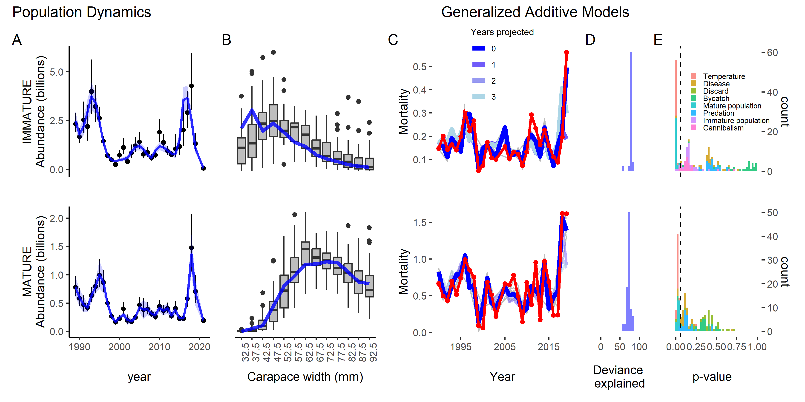
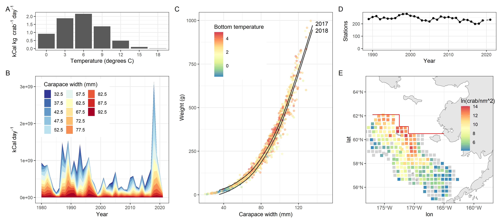

```{r, include=FALSE}

knitr::opts_chunk$set(echo=FALSE,message=FALSE,warning=FALSE)

library(plyr)
library(dplyr)
library(knitr)
library(ggplot2)
library(PBSmodelling)
library(pander)
library(coda)
library(maps)
library(lattice)
library(PBSmapping)
library(mapdata)    #some additional hires data
library(maptools)   #useful tools such as reading shapefiles
library(mapproj)
library(plotrix)

in_path<-"C:/gmacs/gmr/R/"
library(ggridges)
library(reshape2)
library(miceadds)
source.all( path=in_path, grepstring="\\.R",  print.source=TRUE, file_sep="__"  )

#source("plot.bubble.residuals.addn.R")

```

Snow crab are an iconic species in the Bering Sea that support an economically important fishery and undergo extensive monitoring and management. Since 2018 more than 10 billion snow crab have disappeared from the eastern Bering Sea and the population collapsed to historical lows in 2021. We link this collapse to a marine heatwave in the eastern Bering Sea during 2018 and 2019. Calculated caloric requirements, reduced spatial distribution, and observed body condition suggest that starvation played a role in the collapse. The mortality event appears to be one of the largest reported losses of motile marine macrofauna to marine heatwaves globally. 

\newpage

Snow crab (*Chionoecetes opilio*) is one of the most abundant and widely distributed species in the benthic ecosystem of the eastern Bering Sea. The snow crab population has supported an iconic fishery valued at ~ US$150 million (ex-vessel average from 2012-2021) and fisheries management in Alaska is considered some of the most effective in the world (2). A key component of this management is a yearly bottom trawl survey conducted by the National Marine Fisheries Service that monitors the size and number of snow crab on the eastern Bering shelf (\autoref{data_figure}a). Many field and laboratory studies aimed at understanding population processes like growth and maturity have also been performed (e.g. 3). In spite of this attention and effort, the stock unexpectedly collapsed in 2021.

The collapse in 2021 occurred three years after the observed abundance of snow crab was at historical highs (\autoref{data_figure}c). Groups of crab of similar sizes are called ‘pseudocohorts’ because true cohorts cannot be identified as a result of difficulties in ageing crab associated with the loss of the hard body parts during the molting process. The largest pseudocohort on record began to be observed in the survey beginning in 2015 and unexpectedly declined by roughly half from 2018 to 2019 (\autoref{data_figure}d). The survey was cancelled in 2020 because of the coronavirus pandemic. The 2021 survey found the fewest snow crab on the eastern Bering Sea shelf since the survey began in 1975. More than 10 billion crab disappeared from the eastern Bering Sea shelf from 2018 to 2021 (4).

Hypotheses to explain the disappearance fall under two categories: either the crab are still alive but the survey did not sample them or the crab died. It is possible the crab are in the eastern Bering Sea, but were poorly sampled by the most recent surveys. If this were the case, one would expect estimates for other similar species like Tanner crab to have declined unexpectedly, but the population trend for Tanner crab increased (Fig. S1). Movement to the northern Bering Sea could account for declines in the eastern Bering Sea, but surveys in the northern Bering Sea did not find crab in the quantities or of the correct sizes to explain declines in the southeast (\autoref{data_figure}a). Movement west into Russian waters is another possibility, but Russian scientists reported declines in catch per unit effort in 2020 (5), which one might not expect if crab from Alaska emigrated. Finally, it is possible that the crab moved into deeper waters on the Bering Sea slope. High fishery catch per unit effort in deeper waters during the 2021 fishery supports this possibility to some extent, but the amount of available habitat is less than 10% of that on the shelf (6) and fishery catch per unit effort during 2022 was the lowest on record (Fig. S2). Consequently, it is unlikely that all of the missing crab from the shelf are on the slope. Given these observations, mortality is a likely culprit for the bulk of the collapse.

Changes in temperature, predation, fishery effects, disease, and/or cannibalism could affect mortality rates. Snow crab are generally associated with cold-water, but they can function in waters up to 12 degrees C in the laboratory (7). A marine heatwave occurred in the Bering Sea during 2018 and 2019 and the ‘cold pool’ (a mass of water <2 degrees C on the sea floor with which juvenile snow crab are associated) was absent during this period (\autoref{data_figure}b). While not fatal, the resulting bottom temperatures could affect metabolic rates and alter intra- and inter-specific interactions. Smaller crab are a major component in the diet of Pacific cod in the Bering Sea (8) and recent changes in the distribution and abundance of cod and crab have contributed to increased consumption of crab by cod (Fig. S3). Removals by the snow crab fishery and incidental mortality in fisheries for other species in the Bering Sea may also impact the population dynamics of snow crab. Furthermore, larger snow crab are known to cannibalize smaller snow crab and this has been suggested as an important driver of population dynamics in eastern Canadian populations (9). Finally, bitter crab syndrome, a fatal disease resulting from infection by a dinoflagellate (10), has been observed more frequently in the survey in the last several years and is generally associated with warmer conditions and high densities of immature crab.

To understand the recent collapse, we first attempted to understand the historical variability in mortality. We fit a population dynamics model to the abundance and size composition data for male crab and estimated recruitment (small crab entering the population) and a maturity- and year-specific total mortality. ‘Total mortality’ represents the fraction of crab dying in a given year due to any cause. We then collated maturity-specific time series of potential stressors from 1990 to 2019 and used them in generalized additive models (GAMs; 11) to predict total mortality estimated from the population dynamics models (see materials and methods for detailed methodology, sensitivities, and simulation testing).

The population dynamics model fit the indices of abundance and size composition data from the survey well, which is not unexpected, given the flexibility of the model (\autoref{fits_figure}a & b). Estimated mortality was higher and more varied for mature crab than for immature crab, and estimated mortalities in 2018 and 2019 were the some of the highest in the time series for immature and mature crab. We simulated snow crab populations with time-variation in mortality to understand the ability of our population dynamics model to estimate these quantities with the available data. The correlation between estimated mortality and simulated mortality were high which suggests that analyses relating estimates of mortality and environmental covariates are justifiable (see materials and methods). 

GAMs fit to estimated immature and mature mortality explained ~78% and ~72% of the variability, respectively (\autoref{fits_figure}c). Higher temperatures and higher densities of mature crab were significantly associated with higher estimated mortality for mature crab. Higher temperatures were also associated with higher immature mortality, but the best-fitting relationship between immature mortality and mature density was dome-shaped. The importance of temperature and density was robust to changes in data quantity (e.g. leave-one-out cross validation), consideration of the uncertainty in mortality estimates, and randomization trials (see materials and methods). 

Our results do not support a strong connection between variability in snow crab mortality and indices of trawling, predation, cannibalism, or disease. All of these forces must contribute to underlying mortality to some degree, but several observations corroborate the idea that temperature and population density were the key variables in the recent collapse. Cod predation was near average levels during the collapse when considering the number of snow crab in the system and for half of the year a large fraction of the cod population moved out of the eastern Bering Sea into the northern Bering Sea, which rarely occurs. This movement would serve to decrease the already average predation on snow crab. Further, the missing snow crab were of a size that is larger than cod usually eat in large numbers. Trawling pressure has been another oft-raised potential cause of the collapse, but trawling activity in the Bering Sea has been relatively consistent over the last ~20 years. The observed bycatch of snow crab by trawlers was several times lower during the collapse than historical highs and estimated mortality was low during the historical periods of high bycatch. This observation, coupled with the fact that the largest cohort in history established and grew on the sea shelf for ~8 years under consistent trawling pressure makes it difficult to reconcile the idea that trawling contributed to the collapse. The supplementary text holds a more in depth discussion of these points.  

Assessing the predictive skill of a model is an important check on over-fitting and is relevant to providing management advice. After an ecologically and economically costly collapse, it is natural to ask if we could have foreseen the collapse. To explore this question, we excluded 1, 2, and 3 years of data from the end of the time series, refit the models, then tried to predict the excluded years of mortality with the covariates from those years. The model for immature mortality contained enough information in 2016 to forecast an increase in mortality, but it was not able to reach the magnitude of the estimated mortality in 2019 (\autoref{fits_figure}c). The model for mature mortality performed similarly, forecasting an increase in mortality over the projection period, but it was not able to reach the estimated mortalities until the most recent data was included in the model. This suggests that the circumstances underpinning the recent collapse were unprecedented in the Bering Sea in recent history.

The collapse of eastern Bering Sea snow crab appears to be one of the largest reported losses of motile marine macrofauna to marine heatwaves globally (12), exacerbated by the record number of snow crab in the ecosystem. However, the thermal limits of snow crab exceed the observed temperatures (7). Temperature-dependent caloric requirements are a potential explanation to relate temperature to mortality. Foyle et al. (7) showed that caloric requirements for snow crab in the lab nearly double from 0 degrees to 3 degrees C, which is roughly the change experienced by immature crab from 2017 to 2018 (\autoref{temp_fig}a). Caloric requirements in 2018 (calculated from temperature occupied, abundance of crab at size, and weight at size) quadrupled for the modeled fraction of snow crab in the eastern Bering Sea from 2017 and were double the previous maximum value in 1989 (\autoref{temp_fig}b). The impact of increased caloric demands appears to be reflected in the observed weight at size. A 75 mm carapace width crab in 2018 weighed on average 156 grams and was ~25 grams lighter (~15% of its bodyweight) than a crab in 2017 of the same size in the same temperature waters (\autoref{temp_fig}c). Furthermore, the spatial footprint of the stock was near the lowest levels historically in 2018 (Figs. 3d & 3e). The unprecedented caloric demands coupled with a small area from which to forage relative to historical grounds suggests starvation likely played a role in the disappearance of more than 10 billion snow crab, similar to the marine-heatwave related collapse of Pacific cod in the Gulf of Alaska in 2016 (13). 

The eastern Bering Sea snow crab population has collapsed once before in the late 1990s, but that collapse arose from a lack of recruitment, not a sudden mortality event. The Arctic Oscillation and sea ice have been linked to snow crab recruitment and projections of recruitment suggest snow crab abundances will decline in the future as sea ice disappears from the eastern Bering Sea (14). However, these declines were projected to occur at least twenty years from now. Given the recent collapse, the short-term future of snow crab in the eastern Bering Sea is precariously uncertain. Over the long-term, the northern Bering Sea is a prospective climate refuge for snow crab (and potentially a fishery; 15), but the possibility of a fishery rests on the uncertain prospect of crab growing to a larger size in the north and the currents retaining pelagic larvae released in the northern Bering Sea.
In 2020/2021, 59 boats fished for snow crab which brought $227 million (ex-vessel) into fishing communities (16). The disappearance of snow crab will be a staggering blow to the functioning of some communities in rural Alaska like those on Saint Paul Island, which rely strongly on the revenue derived from the capture and processing of snow crab. The Magnuson-Stevens Act includes provisions for fisheries disaster assistance, which were designed to provide economic support for communities facing hardship as a result of collapsed fisheries. The number of applications in the United States has been increasing in recent years (17) and an application for snow crab was received in early 2022. These funds are a boon in the medium-term, but years can pass between disaster to dispersal of these funds. Consequently, Alaskan crabbers face an uncertain short-term future as the disaster funds may not arrive in time to forestall the bankruptcy of long-standing businesses.
Beyond the fishery for snow crab, Alaskan fisheries are some of the most productive in the world, producing 5.27 billion tons of seafood in 2021 valued at $1.9 billion (18). The collapse of snow crab was a dramatic response to a marine heatwave and other populations in the Bering Sea also suffered large losses. Salmon populations in the north collapsed and seabird and seal die-offs occurred (19). However, other populations are flourishing. Sablefish abundances are at all-time highs in the Bering Sea (20), and the assessment for walleye pollock (which supports the largest fishery in the Bering Sea and one of the largest in the world, 21) reported one of the largest estimated year classes established in 2018 (22). Pollock may still decline under continued warming (23), but the short-term response to dramatically warmer bottom waters was a population boom. The adaptive capacity of species is a key uncertainty in the outcome of warming oceans, but it is very probable that the benthic community in the eastern Bering Sea in the not-too-distant future will look different than today’s given the rapid pace of warming (24).
Overfishing has historically been the largest threat to global fisheries, but, in many parts of the world, this problem has been addressed with careful management (2). Climate change is the next existential crisis for fisheries, and snow crab is a prime example for how quickly the outlook can change for a population. In 2018, catches were projected to increase to levels not seen in decades. Three years later, the population had collapsed. Our current management tools base management targets and projected sustainable yields on the historical dynamics of a population. However, projections based on historical dynamics are unreliable when the future environmental conditions of a region will not resemble the past. Incorporating environmental drivers into management targets has been a recent focus of the scientific literature, but this can result in counter-intuitive management responses like increasing exploitation rates on populations undergoing climate-related declines in productivity (25). Our experience in the management of a collapsing snow crab population suggests that considering environmental drivers in estimates of biomass used to set catch limits can be important, but how to consider environmental change in management targets is an unresolved question.
Beyond reconsidering how sustainable catches and management targets are calculated under wide-spread changes in productivity, other practical matters need close attention from fisheries managers and stakeholders.  These include: 1) enacting efficient and timely disaster response with plans for the possibility that a ‘disaster’ is permanent, 2) implementing management institutions that allow fishers to pursue diverse portfolios of species, and 3) ensuring consistent and timely biological surveys. Support for the development of alternative marine-based livelihoods (e.g. mariculture) may also alleviate some of the pressures associated with fisheries collapses. The Bering Sea is on the front lines of climate-driven ecosystem change and the problems currently faced in the Bering Sea foreshadow the problems that will need to be confronted globally.


# Acknowledgments
We would like to thank the Resource Assessment and Conservation Engineering Division and the Kodiak Shellfish Assessment Program at the Alaska Fisheries Science Center, and the Alaska Department of Fish and Game for long-term data collection efforts, without which analyses like this would be impossible. We also thank the Bering Sea Fisheries Research Foundation for selectivity data from their trawl experiments. Anne Hollowed, Stephani Zador, Lewis Barnett, Steve Barbeaux, the members of the North Pacific Fisheries Management Council’s Crab Plan Team, the Science and Statistical Committee, and three anonymous reviewers provided comments that improved this manuscript.

# Supplementary materials
The github repository including the code used to perform the analysis can be found at: https://github.com/szuwalski/snow_down.

\newpage

# References

1. North Pacific Fishery Management Council. 2010. Five-Year Review of the Crab Rationalization Management Program for Bering Sea and Aleutian Islands Crab Fisheries; Appendix B: Review of Safety Under the Crab Rationalization Management Program for Bering Sea and Aleutian Islands Crab Fisheries. North Pacific Fishery Management Council,1007 West 3rd Ave., Suite 400, L92 Building, 4th floor. Anchorage, AK 99501

2. Hilborn, R., Amoroso, R.O., Anderson, C.M., Baum, J.K., Branch, T.A., Costello, C., De Moor, C.L., Faraj, A., Hively, D., Jensen, O.P., Kurota, H., Little, R.L., Mace, P., McClanahan, T., Melnychuk, M.C., Minto, C., Osio, G.C., Parma, A.M., Pons, M., Segurado, S., Szuwalski, C.S., Wilson, J.R., Ye, Y. 2021. Effective fisheries management instrumental in improving fish stock status. Proc. Natl. Acad. Sci. 117(4): 2218-2224.

3. Copeman, L.A., Ryer, C.H., Eisner, L.B., Nielsen, J.M., Spencer, M.L., Iser, P.J. 2021. Decreased lipid storage in juvenile Bering Sea crab (*Chionoecetes* spp.) in a warm (2014) compared to a cold (2012) year on the southeastern Bering Sea. Polar Biol. 44(9): 1883-1901.

4. Szuwalski, C.S. 2021. Stock assessment of Eastern Bering Sea snow crab. Stock Assessment and Fishery Evaluation Report for the King and Tanner Crab Fisheries of the Bering Sea and Aleutian Islands Regions. 2021 Crab SAFE. North Pacific Fishery Management Council,1007 West 3rd Ave., Suite 400, L92 Building, 4th floor. Anchorage, AK 99501

5. Chernienko, I.S. Standardization of landing efficiency of opilio crab in the western Bering Sea by using generalized additive models. Russia Pacific Fisheries Research Center (TINRO). 210(2): 359-370.

6. Foyle, T.P. and O'Dor, R.K. 1989. Energetically defining the thermal limits of the snow crab. J. Exp. Biol 145: 371-393.

7. Lang, G.M. and Livingston, P.A. 1996. Food habits of key groundfish species in the eastern Bering Sea slope regions. NOAA Technical Memorandum NMFS-AFSC-67.

8. Lovrich, G.A., and Sainte-Marie, B. 1997. Cannibalism in the snow crab, *Chionoecetes opilio* and its potential importance to recruitment. J. Exp. Mar. Bio. and Eco. 211: 225-245.

9. Meyers, T.R., Morado, J.F., Sparks, A.K., Bishop, G.H., Pearson, T., Urba, D., Jackson, D. 1996 Distribution of bitter crab syndrome in Tanner crab (*Chionoecetes bairdi*, *C. opilio*) from the gulf of Alaska and the Bering Sea. Dis. Aquat. Org. 26: 221-227.

10. Wood, S.N. 2011. Fast stable restricted maximum likelihood and marginal likelihood estimation of semiparametric generalized linear models. J. Royal Stat. Soc. (B), 73(1), 3-36.

11. Smith, K.E., Burrows, M.T., Hobday, A.J., King, N.G., Moore, P.J., Gupta, A.S., Thomsen, M.S., Wernbeg, T., Smale, D.A. 2023. Biological impacts of marine heatwaves. Annu. Rev. Mar. Sci. 15: 12.1-12.27.

12. Barbeaux, S.J., Holsman, K., Zador, S. 2020. Marine heatwave stress test of ecosystem-based fisheries management in the Gulf of Alaska Pacific cod fishery. Front. Mar. Sci. 7: 703.

13. Szuwalski, C.S., Cheng, W., Foy. R., Hermann. A.J., Hollowed, A.B., Holsman, K., Lee, J., Stockhausen, W., Zheng, J.  2020. Climate change and the future productivity and distribution of crab in the eastern Bering Sea. ICES J. Mar. Sci. 78(2): 502-515.

14. Fedewa, E.J., Jackson, T.M., Richar, J., Gardner, J.L., Litzow, M.A. 2020. Recent shifts in northern Bering Sea snow crab size structure and the potential role of climate-mediated range contraction. Deep Sea Res II. 181-182: doi.org/10.1016/j.dsr2.2020.104878

15. Garber-Yonts, B., Lee, J. 2021. SAFE report for the king and tanner crab fisheries of the Gulf of Alaska and Bering Sea/Aleutian Islands Area: Economic status of the BSAI king and tanner crab fisheries off Alaska, 2021. North Pacific Fishery Management Council,1007 West 3rd Ave., Suite 400 L92 Building, 4th floor, Anchorage, Alaska 99501.

16. Bellquist, L., Saccomanno, V., Semmens, B., Gleason, M., Wilson, J. 2021. The rise in climate change induced federal fishery disasters in the United States. Peer J. 9: e11186.

17. NOAA Fisheries. 2022. Fisheries of the United States Report. www.fisheries.noaa.gov/foss

18. Food and Agriculture Organization (FAO). 2022. The state of world fisheries and aquaculture 2022. Towards blue transformation. Rome, FAO. https://doi.org/10.4060/cc0461en

20. Siddon, E.C., Zador, S.G., Hunt, G.L. 2020. Ecological responses to climate perturbations and minimal sea ice in the northern Bering Sea. Studies in Oceanography. 181-182, 104914.

21. Goethel et al., Sablefish assessment.

22. Ianelli, J. et al. Pollock assessment.

23. Pollock population declining MSE.

19. Rantanen, M., Karpechko, A.Y., Lipponen, A., Nordling, K., Hyvarinen, O., Ruosteenoja, K. Vihma, T., Laaksonen, A. 2022. The Arctic has warmed nearly four times faster than the globe since 1979. Commun. Earth & Environ. 3: 168.

25. Szuwalski, C.S., et al. 2023. Unintended consequences of climate adaptive fisheries management targets. Fish Fish 

20. Tamone, S.L., M. Adams and J.M. Dutton.  2005.  Effect of eyestalk ablation on circulating ecdysteroids in hemolymph of snow crab Chionoecetes opilio:  physiological evidence for a terminal molt.  Integr. Comp. Biol., 45(120), p.166-171.

21. Somerton, D.A., Weinber, K.L., Goodman, S.E. 2013. Catchability of snow crab (Chionoecetes opilio) by the eastern Bering Sea bottom trawl survey estimated using a catch comparison experiment. Can J Fish Aquat Sci. 70: 1699-1708.

22. Szuwalski, C.S. 2022. Estimating time-variation in confounded processes in populationdynamics modeling: A case study for snow crab in the eastern Bering Sea. Fish. Res. doi.org/10.1016/j.fishres.2022.106298

23. Hamel, O. 2015. A method for calculating a meta-analytical prior for the natural mortality rate using multiple life history correlates. ICES J. Mar. Sci. 72: 62-69.

24. Thompson, G.G. 1994. Confounding of gear selectivity and natural mortality rate in cases where the former is a nonmonotone function of age. Can. J. Fish. Aquat. Sci. 51(12): 2654-2664.

25. Johnson, K.F., Monnahan, C.C., McGilliard, C.R., Vert-Pre, K.A., Anderson, S.C., Cunningham, C.F., Hurtado-Ferro, F., Licandeao, R.R., Muradian, M.L., Ono, K., Szuwalski, C.S., Valero, J.L., Whitten, A.R., Punt, A.E. 2014. Time-varying natural mortality in fisheries stock assessment models: identifying a default approach. ICES J. Mar. Sci. 72(1): 137-150.

26. Akaike, H. 1974. A new look at the statistical model identification. IEEE Trans. Auto. Con. 19(6): 716-723.

27. Dorn, M.W. and Barnes, C.L. 2022. Time-varying predation as a modifier of constant natural mortality for Gulf of Alaska walleye pollock. Fish. Res. 254: doi.org/10.1016/j.fishres.2022.106391

28. Zacher, L.S., Richar, J.I., Fedewa, E.J., Ryznar, E.R., Litzow, M.A. 2022. The 2022 Eastern Bering Sea Continental Shelf Trawl Survey: Results for Commercial Crab Species. NOAA Technical Memorandum NMFS-AFSC. https://apps-afsc.fisheries.noaa.gov/plan_team/resources/draft_ebs_crab_tech_memo_2022.pdf

29. Alaska Fisheries Information Network (AKFIN). 2022. https://akfin.psmfc.org/

30. Ernst, B, J.M.(Lobo) Orensanz and D.A. Armstrong.  2005.  Spatial dynamics of female snow crab (*Chionoecetes opilio*) in the eastern Bering Sea.  Can. J. Fish. Aquat. Sci. 62: 250-268.

31. Parada, C., Armstrong, D.A., Ernst, B., Hinckley, S., and Orensanz, J.M. 2010. Spatial dynamics of snow crab (*Chionoecetes opilio*) in the eastern Bering Sea--Putting together the pieces of the puzzle. Bulletin of Marine Science. 86(2): 413-437.

32. Mueter, F.J., Litzow, M.A. 2008. Sea ice retreat alters the biogeography of the Bering Sea continental shelf. Ecological Applications. 18(2): 309-320.

33. Dionne, M., Sainte-Marie, B., Bourget, E., Gilbert, D. 2003. Distribution and habitat selection of early benthic stages of snow crab (*Chionoecetes opilio*). Mar. Eco. Pro. Ser. 259: 117-128.

34. Barbeaux, S.J., Holsman, K., and Zador, S. 2020.    Marine heatwave stress test of ecosystem-based fisheries management in the Gulf of Alaska Pacific cod fishery. Front. Mar. Sci. 7:703.  https://doi.org/10.3389/fmars.2020.00703 

35. Holsman K.K., Aydin, K. 2015. Comparative methods for evaluating climate change impacts on the foraging ecology of Alaskan groundfish. Mar Ecol Prog Ser 521:217-235. https://doi.org/10.3354/meps11102

36. Livingston, P.A., Aydin, K., Buckley, T.W., Lang, G.M., Yang, M-S, and Miller, B.S. 2017. Quantifying food web interactions in the North Pacific–a data-based approach. Environ. Biol. Fish. 100:443–470. doi: 10.1007/s10641-017-0587-0

37. Burgos, J., Ernst, B., Armstrong, D., Orensanz, J.M. 2013. Fluctuations in range and abundance of snow crab from the eastern Bering Sea: What role for Pacific cod predation? Bull. Mar. Sci. 89(1): 57-81.

38. Kleiber, M. 1947. Body size and metabolic rate. Physio. Rev. 27: 511-520

39. Hardy, D., Dutil, J.D., Godbout, G., Munro, J. 2000. Survival and condition of hard shell male adult snow crabs during fasting at different temperatures. Aquaculture. 189: 259-275.


\newpage


```{r,echo=FALSE,warning=FALSE,message=F,out.width="98%",fig.cap="\\label{data_figure}The collapse of snow crab in the eastern Bering Sea. Snow crab are widely distributed on the eastern Bering Sea shelf (a, each square represents a survey tow with snow crab present and the red line separates the northern Bering Sea survey and eastern Bering Sea survey extent) and densities of crab were an order of magnitude lower in 2021 compared to 2018. Changes in ice extent and the resulting cold pool area (b) influence the population dynamics (c) of snow crab (only male abundance is plotted; shading is the 95\\% confidence intervals). The collapse of crab was not size-dependent; crab of all sizes disappeared from 2018 to 2021, panel (d) shows the relative numbers at size at crab observed in the survey over time. Vertical dashed line indicates the size at which the fishery begins to capture crab. Note that smaller crab are poorly captured by the survey gear, so the true size of a cohort is not apparent until a few years after it is first observed in the survey--compare 2015 to 2018 for an example."}


```

\newpage

```{r,echo=FALSE,warning=FALSE,message=F,out.width="98%",fig.cap="\\label{fits_figure}Population dynamics model fits and covariate relationships with mortality. Population dynamics model fits to the survey data (points and vertical lines are observed abundances and estimates are blue with 95\\% confidence intervals shaded in light blue (a), box plots are size composition data aggregated over the study period with average estimated size composition over year by size in blue (b)). Fits (c; in blue) to estimated mortality (in red) from Generalized Additive Models with the deviance explained (d) and the significance of covariates (e) resulting from replicates over leave-one out cross validation. The top row relates to immature crab; the bottom row relates to mature crab. Lighter colors of blue in (c) are fits of the model with a given number of years excluded from the end of the time series and then predicting the held out data."}



```

\newpage

```{r,echo=FALSE,warning=FALSE,message=F,out.width="98%",fig.cap="\\label{temp_fig}Effects of temperature and density on metabolic requirements. Impact of temperature on caloric requirements for snow crab in the lab (a; reproduced from Foyle et al., 1989), the extrapolated caloric requirements for crab in the eastern Bering Sea based on temperature, abundance at size, and weight at size (b), and the observed weight at size colored by the temperature at which the crab was collected (c). The lines represent the relationship between weight at size in 2017 and 2018 while holding temperature at 1 degree. The spatial extent of the stock has varied over time, seen through the number of stations at which crab were observed in the 40 square nautical mile grid (d). The distribution in 2018 (colored tiles in (e)) was one of the smallest on record (grey tiles indicate maximum historical range)."}




```


